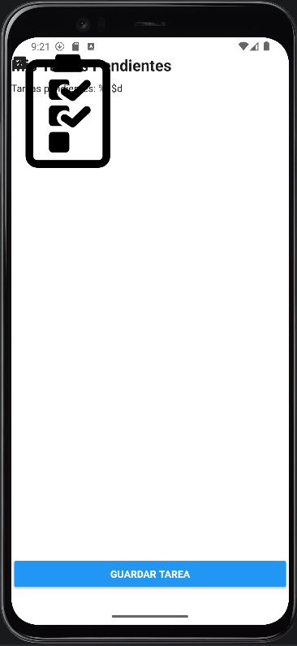
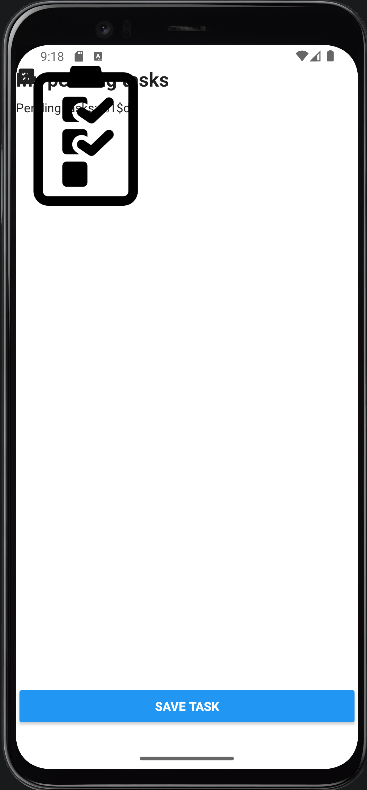

# MyTasklist
MyTasklist es una aplicación de productividad personal basada en una lista de tareas dirigida principalmente a estudiantes y profesionales que necesitan apuntar rápidamente tareas pendientes del día a día de forma ordenada y sin distracciones. Permite al usuario crear una nueva tarea introduciendo el título y descripción en menos de 10 segundos y visualizar la lista completa de tareas pendientes en la pantalla principal de forma inmediata al abrir la app.  

  

Para ejecutar la aplicación, abrimos MainActivity.java y le damos a ejecutar (debemos de tener al menos un AVD en nuestro Android Studio). Una vez se ejecute el emulador, esperamos a que se compile la aplicación y esta se instalará automáticamente, permitiéndonos utilizarla desde ese preciso momento.